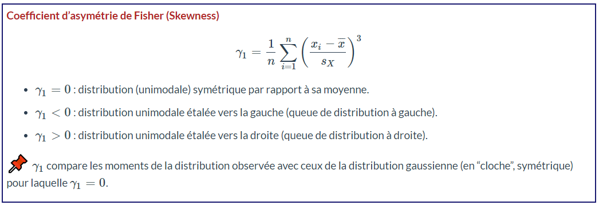

# Installation des librairies  {.unnumbered}
```{r}
library(rmarkdown)
library(tidyverse) # pour  %>%
library(questionr) #rename.variable
library(kableExtra)
library(knitr)
library(e1071) # skewness et kurtosis
library(ggplot2)
library(plotly) # graphes dynamiques
library(MASS)
library(fitdistrplus) #graphe Cullen & Fr
library(e1071)
```

# Task 1.  Téléchargement des données

```{r}
mydata=read.csv2("mytrain_subset.csv", sep=",")
paged_table(mydata)
summary(mydata)
```

Pour alléger les écritures, procédons à des copies de nos variables
```{r}
Prix_Vente<-mydata$Prix_Vente
Année_Construction<-mydata$Année_Construction
Année_Vente<-mydata$Année_Vente
Mois_Vente<-mydata$Mois_Vente
Surface<-mydata$Surface
Niveau_Etage<-mydata$Niveau_Etage
TCouloir<-mydata$TCouloir
TChauffage<-mydata$TChauffage
TGestion<-mydata$TGestion
Nb_Parking_Surface<-mydata$Nb_Parking_Surface
Nb_Parking_Sous_So<-mydata$Nb_Parking_Sous_Sol
Temps_Bus<-mydata$Temps_Bus
Nb_Appartment_Batiment<-mydata$Nb_Appartment_Batiment
Nb_Gestionnaire<-mydata$Nb_Gestionnaire
Nb_Ascenseurs<-mydata$Nb_Ascenseurs
Station_Metro<-mydata$Station_Metro
Nb_Bureau_Publics<-mydata$Nb_Bureau_Publics
Nb_Hopitaux<-mydata$Nb_Hopitaux
Nb_Grands_Magasins<-mydata$Nb_Grands_Magasins
Nb_Centre_Commerciaux<-mydata$Nb_Centre_Commerciaux
Nb_AUtres_Proximité<-mydata$Nb_AUtres_Proximité
Nb_Parcs<-mydata$Nb_Parcs
Nb_Ecoles_Primaires<-mydata$Nb_Ecoles_Primaires
Nb_Ecoles_Colléges<-mydata$Nb_Ecoles_Colléges
Nb_Ecoles_Lycée<-mydata$Nb_Ecoles_Lycée
Nb_Ecoles_Universités<-mydata$Nb_Ecoles_Universités
Nb_Installations<-mydata$Nb_Installations
Nb_Total_Proximité<-mydata$Nb_Total_Proximité
Nb_Total_Ecoles<-mydata$Nb_Total_Ecoles

```

# Task 1 - Min-Max Surface
```{r}
Min_Surface = min(Surface)
Max_Surface = max(Surface)
print(paste("Min Sutrface : ", Min_Surface))
print(paste("Max Sutrface : ", Max_Surface))
```

# Task 1 - Effectifs de Surface

## Task 1.1 - - Découpage par intervalles éguaux
```{r}
T_eff_Surface_10<-table(cut(Surface,breaks=10)) 
T_eff_Surface_10
```
## Task 1.2 - - Découpage par quartiles
```{r}
T_eff_Surface_quartiles<-table(cut(Surface,breaks = quantile(Surface, probs = seq(0,1,0.25)), include.lowest = TRUE)) 
T_eff_Surface_quartiles
```
## Task 1.3 - - Découpage par seuils
```{r}
seuils <- c(0,250,500,750,1000,1250,1500,1750,2000,2250,2500)
T_eff_Surface_categories <- table(cut(Surface, breaks = seuils, include.lowest = TRUE))
T_eff_Surface_categories

```
## Task 1.3 - - Découpage par seuils
```{r}
set.seed(2024)
T_eff_Surface_Clusters <- table(kmeans(Surface, centers = 5)$cluster)
T_eff_Surface_Clusters
```


# Task 2 - Effectifs cummulés de Station_Metro
```{r}
cumsum(T_eff_Surface_10)
```

# Task 3 - Fréquence des modalités de Station_Metro
```{r}
T_freq_Surface_10 <- prop.table(T_eff_Surface_10)
```

# Task 4 - Fréquences cumulés de Station_Metro
```{r}
cumsum(prop.table(T_eff_Surface_10))
```

# Task 5 - Indicateurs de tendance centrale et de position

## Moyenne empirique. Pour les variables quantitatives uniquement!
```{r}
Moyen_Surface <- mean(Surface)
print(paste("Moyen Surface", Moyen_Surface))
```
## Mode(s)/ Classe(s) modale(s) empirique(s). Modalité(s) la/les plus fréquente(s).
```{r}
c(which.max(T_eff_Surface_10),max(T_eff_Surface_10))
```

## Les quantilles 
```{r}
quantile(Surface)
cat("\n")
print(paste("1er quantile:", quantile(Surface, 0.25)))
cat("\n")
print(paste("2eme quantile:", median(Surface)))
cat("\n")
print(paste("3eme quantile:", quantile(Surface, 0.75)))
```

# Task 6 - Indicateurs de dispersion
```{r}
rbind(paste0(c("variance corrigée: ", var(Surface))),
paste0(c("variance : ", mean(Surface^2)-(mean(Surface))^2)),
paste0(c("Écart type corrigé: ", sd(Surface))),
paste0(c("Écart type : ", sqrt(mean(Surface^2)-(mean(Surface))^2))))

rbind(paste0(c("Etendu : ", max(Surface)-min(Surface))),
paste0(c("IQ : ",quantile(Surface,prob=0.75)-quantile(Surface,prob=0.25) )))
```

# Task 6 - Indicateurs de forme


```{r}
skewness(Surface)
```
γ1>0 : distribution unimodale étalée vers la droite (queue de distribution à droite).


```{r}
kurtosis(Surface)
```
γ2<0 : la distribution observée est plus aplatie qu’une distribution gaussienne (de même moyenne et de même variance).

# Task 7 - Représentations graphiques
```{r}
T_eff_Surface_10_Ordonnée <- factor(names(T_eff_Surface_10), levels = names(T_eff_Surface_10)) 
plot_ly(
  x = T_eff_Surface_10_Ordonnée,
  y = as.numeric(T_eff_Surface_10),
  type = 'bar', 
  marker = list(color = "purple")) %>%
  layout(title = 'Distribution des surfaces',
         xaxis = list(title = 'Surface'),
         yaxis = list(title = 'Effectifs'))
```

## Diagramme en secteurs
Chaque secteur angulaire est proportionnel à l’effectif (ou à la fréquence).

```{r}
couleur <- c("#FF5733", "#33FFB1", "#3379FF") 
couleur1 <- c("#890090", "#402023", "#59F9FF") 

plot_ly(
  labels =  T_eff_Surface_10_Ordonnée, 
  values = as.numeric(T_eff_Surface_10), 
  type = 'pie', 
  marker = list(colors = couleur1)) %>%
  layout(title  = 'Niveau: Diagramme en secteurs')
```

## Boxplot/Boîte de distribution/boîte à moustache
Résume quelques caractéristiques de position et de dispersion du caractére étudié (médiane, quartiles, minimum, maximum ou déciles).
```{r}
plot_ly(y = Surface, type = "box",name = "", marker = list(color = "pink"))%>%
 layout(title = 'Surface (pied2)',
     yaxis = list(title = 'Taille'))
```

